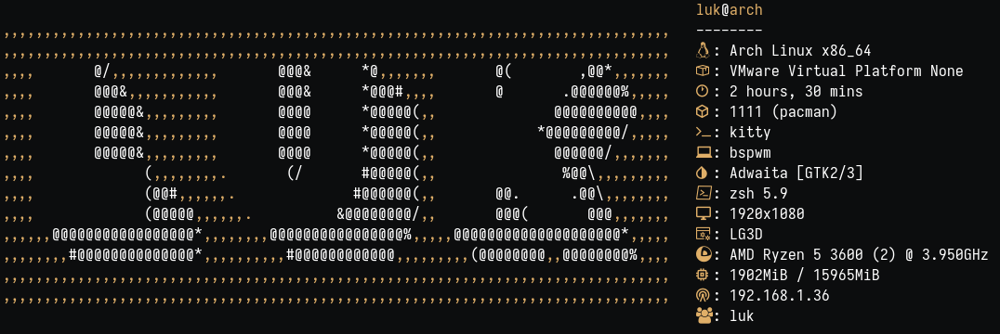

<h1 align="center">
  
  LUK DOTFILES
</h1>

<div align="center">
  
**_With autoinstaller script & based in AlphaTechnolog_**

<div align="left">

## Information ℹ️

Details about the setup:



- **OS:** [Arch Linux](https://archlinux.org)
- **WM:** [bspwm](https://github.com/baskerville/bspwm)
- **Terminal:** [kitty](https://sw.kovidgoyal.net/kitty/)
- **Shell:** bash
- **Editor:** [neovim](https://github.com/neovim/neovim)
- **Compositor:** [picom](https://github.com/yshui/picom)
- **Application Launcher:** [rofi](https://github.com/davatorium/rofi)

## Read 📖
<details>
<summary>📖📖📖</summary>  

**General**  
I recommend reading the entire README.
Once your have the dotfiles installed with script or without it, I recommend you to look all the aliases and functions from `.zshrc` in `/home/$USER/.zshrc`.  
Also I recommend you to read al the shortcuts defined in `sxhkdrc` in `~/.config/sxhkd/sxhkdrc`.  
If you are going to use `archinstall` to install A0rch and give a try to the dotfiles y recommend you this confiuration.

  
**If you use the script**  
You shall have in consideration all the parameters specified at the start of the script.  
The script will late more or less depending on your connection, because it have to download external things.  
  
**When you finish the script**  
Be aware of choosing `BSPWM` as window manager.
The first time you start `nvim` it is going to give an error, just press `ENTER` and it wont happen again.
You can delete from your `/home/$USER` all in relation to `dotfiles-install`.  
If you want to understand all about the `IP MENU'S` you should look in `~/.config/eww/scripts` and `~/.config/rofi/scripts`.

</details>

## Requirements ❗

<details>
<summary>❗❗❗</summary>

**Open the terminal and copy this line:**

---
 
### [rch](lukinstaller.sh)-like 
    
**The script is made to be executed after having installed `ARCH` a terminal and the `GIT` package**

#### First Requirements

```sh
sudo pacman -Sy --noconfirm git
```
</details>

    
## Use 🚀
<details>
<summary>🚀🚀🚀</summary>

```sh
# Don't run the script as root, it will request your password when needed
cd /home/$USER
git clone https://github.com/lukiiimohh/dotfiles-install.git
cd ~/dotfiles-install/
chmod +x lukinstaller.sh
./lukinstaller.sh
# Don't omit the chmod +x lukinstaller.sh step and try to install it with bash lukinstaller.sh (Probably it will fail).  
```

</details>

## Installed Packages 📦
<details>
<summary>📦📦📦</summary>
<div align="center"> 
  
### rch

| Navigators    | Terminal applications | Development Tools | Personalization | Hardware Control | Graphic Interface |
|----------------|-------------------------|---------------------------|------------------|----------------------|------------------|
| Firefox        | Kitty                    | Git                        | Rofi               | Wireless_tools        | Gtk3              |
|                | Bspwm                    | Wget                       | Zsh                | Acpi                  | Gtk-layer-shell   |
|                | Sxhkd                    | Curl                       | Bat                | Acpid                 | Pango             |
|                | Picom                    | Rustup                     | Starship           | Xcursor-themes        | Gdk-pixbuf2       |
|                | Feh                      |                            | Lsd                | Lxappearance          | Cairo             |
|                | Bat                      |                            | Neofetch           | Xcursor-flatbed       | Glib2             |
|                | Exa                      |                            | Xclip              | Locate                | GCC-libs          |
|                | Dunst                    |                            | Vim                | Flameshot             | Glibc             |
|                | Rofi                     |                            | Neovim             | Pavucontrol           |                   |
|                | Playerctl                |                            |  JQ                | Gpick                 |                   |

</details>

<div align="left">

## Shortcuts ⌨️
<details>
<summary>⌨️⌨️⌨️</summary>  

| **Shortcut** | **Action** |
|--------------|-------------|
|super + shift + return|Opens rofi|
|super + m|Show EWW|
|super + f|Opens Firefox|
|super + x|Opens color picker|
|super + @space|Make windows `tile` > `floating`
|super + t|Make windows `floating` > `tile`|
|super + alt + {Left,Up,Down,Right}|Windows Resize|
|super + shift + ctrl + {Left,Up,Down,Right}|Move a floating window|
|super + escape|Restart sxhkd|
|super + shift + q|Quit bspwm|
|super + shift + r|Restart bspwm|
|super + q|Close window|
|super + shift + y|Opens custom rofi menu|
|super + ctrl + {Left,Right}|Switch between workspaces|
|shift + {Left,Up,Down,Right}|Switch between rofi menus|

</details>

## Extra 😎

<details>
<summary>😎😎😎</summary>

In the dotfiles there is a multiricing tool that you can execute with:
```sh
themer -h
```
</details>
  
## Gallery 📸


## AutoInstaller 📋
The script have been tried in this cases: 
 - VMWare Workstation Pro 16 / Using the .iso from official ARCH repositories. With the graphical environment GNOME DESKTOP.  
 - Native System, using ARCHINSTALL and with the .iso from official ARCH repositories. With the graphical environment GNOME DESKTOP.  
  
If someone is interested on trying the script with anothe configuration notify me on discord `lukiiimohh#0633`

## Thanks to 😁
- [alpha](https://github.com/AlphaTechnolog)
- and all the originals helpers...
