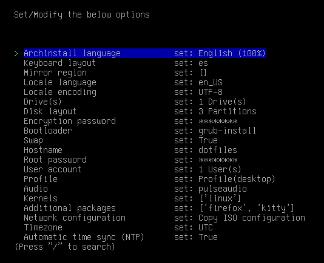

<h1 align="center">
  
  LUK DOTFILES
</h1>

<div align="center">
  
**_Con script autoinstaller & basados en AlphaTechnolog_**

<div align="left">

## Información ℹ️

Detalles sobre el setup:


- **OS:** [Arch Linux](https://archlinux.org)
- **WM:** [bspwm](https://github.com/baskerville/bspwm)
- **Terminal:** [kitty](https://sw.kovidgoyal.net/kitty/)
- **Shell:** bash
- **Editor:** [neovim](https://github.com/neovim/neovim)
- **Compositor:** [picom](https://github.com/yshui/picom)
- **Application Launcher:** [rofi](https://github.com/davatorium/rofi)

## Leer 📖
<details>
<summary>📖📖📖</summary>  

**Generales**  
Recomiendo leer el README entero.
Una vez tengas el entorno instalado ya sea con el script o sin él, te recomiendo mirar todos los alias y funciones del archivo `.zshrc` en `/home/$USER/.zshrc`.  
También te recomiendo leer los atajos de teclado definidos en el `sxhkdrc` en `~/.config/sxhkd/sxhkdrc`.  
Si vas a usar `archinstall` para instalar Arch y así probar el entorno te recomiendo esta configuración de `archinstall`

  
**Si usas el script**  
Debes ajustarte a los parámetros que se especifican antes de iniciar el script.  
El script tarda más o menos depende de tu conexión a internet, debido a que tiene que descargar cosas externas al repositorio.  
  
**Al finalizar el script**  
Asegurate de haber escogido bspwm en el gestor de ventanas de tu sistema.
La primera vez que inicies `nvim` va a dar un error, solo presiona `ENTER` y ya no volverá a suceder.
Puedes borrar de tu `/home/$USER` todo lo relacionado a `dotfiles-install`.  
Si quieres que todo lo relacionado a copiar y pegar IP's funcione debes mirar tanto `~/.config/eww/scripts` como `~/.config/rofi/scripts`.

</details>

## Requerimientos ❗

<details>
<summary>❗❗❗</summary>

**Abre la terminal y copia estas líneas:**

---
 
### [rch](lukinstaller.sh)-like 
    
**Script pensado para que lo ejecutes tras haber instalado ARCH y tengas un mínimo de una consola y el paquete GIT**

#### Primeros requerimientos

```sh
sudo pacman -Sy --noconfirm git
```
</details>

    
## Uso 🚀
<details>
<summary>🚀🚀🚀</summary>

```sh
# No ejecutes el script con sudo, te pedirá la contraseña cuando la necesita
cd /home/$USER
git clone https://github.com/lukiiimohh/dotfiles-install.git
cd ~/dotfiles-install/
chmod +x lukinstaller.sh
./lukinstaller.sh
# No omitas el paso del chmod +x lukinstaller.sh y trates de ejecutarlo con bash lukinstaller.sh (puede dar problemas).  
```

</details>

## Paquetes Instalados 📦
<details>
<summary>📦📦📦</summary>
<div align="center"> 
  
### rch

| Navegadores    | Aplicaciones de terminal | Herramientas de desarrollo | Personalización | Control de hardware | Interfaz gráfica |
|----------------|-------------------------|---------------------------|------------------|----------------------|------------------|
| Firefox        | Kitty                    | Git                        | Rofi               | Wireless_tools        | Gtk3              |
|                | Bspwm                    | Wget                       | Zsh                | Acpi                  | Gtk-layer-shell   |
|                | Sxhkd                    | Curl                       | Bat                | Acpid                 | Pango             |
|                | Picom                    | Rustup                     | Starship           | Xcursor-themes        | Gdk-pixbuf2       |
|                | Feh                      |                            | Lsd                | Lxappearance          | Cairo             |
|                | Bat                      |                            | Neofetch           | Xcursor-flatbed       | Glib2             |
|                | Exa                      |                            | Xclip              | Locate                | GCC-libs          |
|                | Dunst                    |                            | Vim                | Flameshot             | Glibc             |
|                | Rofi                     |                            | Neovim             | Pavucontrol           |                   |
|                | Playerctl                |                            |  JQ                | Gpick                 |                   |

</details>

<div align="left">

## Atajos de ⌨️
<details>
<summary>⌨️⌨️⌨️</summary>  

| **Atajo** | **Acción** |
|--------------|-------------|
|super + shift + return|Abrir rofi|
|super + m|Mostrar barra EWW|
|super + f|Abrir Firefox|
|super + x|Abrir el color picker|
|super + @space|Hacer una ventana `tile` > `floating`
|super + t|Hacer una ventana `floating` > `tile`|
|super + alt + {Left,Up,Down,Right}|Cambiar el tamaño a una ventana|
|super + shift + ctrl + {Left,Up,Down,Right}|Mover una ventana flotante|
|super + escape|Reiniciar sxhkd|
|super + shift + q|Quitar bspwm|
|super + shift + r|Reiniciar bspwm|
|super + q|Cerrar ventana|
|super + shift + y|Abrir menú personalizado rofi|
|super + f|Cambiar a modo pantalla completa|
|super + ctrl + {Left,Right}|Moverse entre escritorios|
|shift + {Left,Up,Down,Right}|Moverse en los menús de la rofi|

</details>

## Extra 😎

<details>
<summary>😎😎😎</summary>

En el entorno hay una herramienta que permite el ricing con multitemas, la herramienta la puedes ejecutar con:
```sh
themer -h
```
</details>
  
## Galería 📸


## AutoInstaller 📋
El autoinstaller solo ha sido puesto en prueba en las siguientes condiciones: 
VMWare Workstation Pro 16 / Usando la .iso de los repositorios oficiales de ARCH. Además de que se ha probado teniendo instalado el entorno gráfico de GNOME DESKTOP.  
  
  Si alguien está dispuesto a probarlo en nativo/otro tipo de configuraciones que me notifique en discord `lukiiimohh#0633` ¡para así ir pudiendo actualizar esta parte!

## Gracias a 😁
- [alpha](https://github.com/AlphaTechnolog)
- y todos los demás ayudantes de los dotfiles originales...
