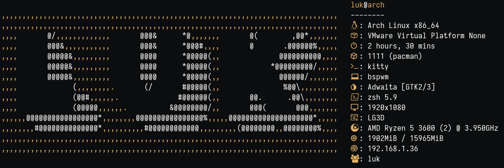

<h1 align="center">
  
  LUK DOTFILES
</h1>

<div align="center">
  
**_Con script autoinstaller  & based on AlphaTechnolog_**

<div align="left">

## ℹ️ Información</samp>

Detalles sobre el setup:



- **OS:** [Arch Linux](https://archlinux.org)
- **WM:** [bspwm](https://github.com/baskerville/bspwm)
- **Terminal:** [kitty](https://sw.kovidgoyal.net/kitty/)
- **Shell:** bash
- **Editor:** [neovim](https://github.com/neovim/neovim)
- **Compositor:** [picom](https://github.com/yshui/picom)
- **Application Launcher:** [rofi](https://github.com/davatorium/rofi)
  
  
## Requerimientos ❗
  
Abre la terminal y copia estas líneas:

---
 
### [rch](lukinstaller.sh)-like 
    
**Script pensado para que lo ejecutes tras haber instalado ARCH y tengas un mínimo de una consola y el paquete GIT**

#### Primeros requerimientos

```sh
sudo pacman -Sy --noconfirm git
```

---
    
## Uso 🚀

```sh
# No ejecutes el script con sudo, te pedirá la contraseña cuando la necesita
cd /home/$USER
git clone https://github.com/lukiiimohh/dotfiles-install.git
cd ~/dotfiles-install/
chmod +x lukinstaller.sh
./lukinstaller.sh
# No omitas el paso del chmod +x lukinstaller.sh y trates de ejecutarlo con bash lukinstaller.sh (puede dar problemas).
```
   
## Paquetes Instalados 📦

<div align="center"> 
  
### rch

| Navegadores    | Aplicaciones de terminal | Herramientas de desarrollo | Personalización | Control de hardware | Interfaz gráfica |
|----------------|-------------------------|---------------------------|------------------|----------------------|------------------|
| Firefox        | Kitty                    | Git                        | Rofi               | Wireless_tools        | Gtk3              |
|                | Bspwm                    | Wget                       | Zsh                | Acpi                  | Gtk-layer-shell   |
|                | Sxhkd                    | Curl                       | Bat                | Acpid                 | Pango             |
|                | Picom                    | Rustup                     | Starship           | Xcursor-themes        | Gdk-pixbuf2       |
|                | Feh                      |                            | Lsd                | Lxappearance          | Cairo             |
|                | Bat                      |                            | Neofetch           | Xcursor-flatbed       | Glib2             |
|                | Exa                      |                            | Xclip              | Locate                | GCC-libs          |
|                | Dunst                    |                            | Vim                | Flameshot             | Glibc             |
|                | Rofi                     |                            | Neovim             | Pavucontrol           |                   |
|                | Playerctl                |                            |  JQ                | Gpick                 |                   |

<div align="left">
       
## Extra 😎
En el entorno hay una herramienta que permite el ricing con multitemas, la herramienta la puedes ejecutar con:
```sh
themer -h
```

  
## Galería 📸


## AutoInstaller 📋
El autoinstaller solo ha sido puesto en prueba en las siguientes condiciones: 
VMWare Workstation Pro 16 / Usando la .iso de los repositorios oficiales de ARCH. Además de que se ha probado teniendo instalado el entorno gráfico de GNOME DESKTOP.  
  
  Si alguien está dispuesto a probarlo en nativo/otro tipo de configuraciones que me notifique en discord `lukiiimohh#0633` ¡para así ir pudiendo actualizar esta parte!

## Gracias a 😁
- [alpha](https://github.com/AlphaTechnolog)
- and all the helpers of the original dotfiles...
